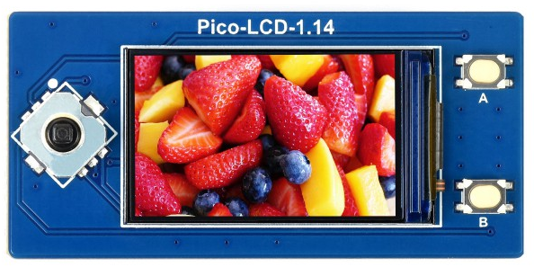

# WaveShare Pico-LCD drivers for DeviceScript

Drivers for RPi Pico display hats by WaveShare.

## Usage

```ts
import { WaveSharePicoLCD114 } from "devicescript-waveshare-pico-lcd"

const board = new WaveSharePicoLCD114()

const gp = board.startGamepad()
const disp = await board.startDisplay()

for (let i = 1; i < 15; ++i)
    disp.image.print(`Hello world c=${i}`, 2, i * 10 - 8, i)
await disp.show()

gp.change.subscribe(btns => {
    if (btns & ds.GamepadButtons.Down) {
        // ...
    }
})
```

## Supported devices

PRs are welcome!

### Pico-LCD-1.14



https://www.waveshare.com/pico-lcd-1.14.htm


